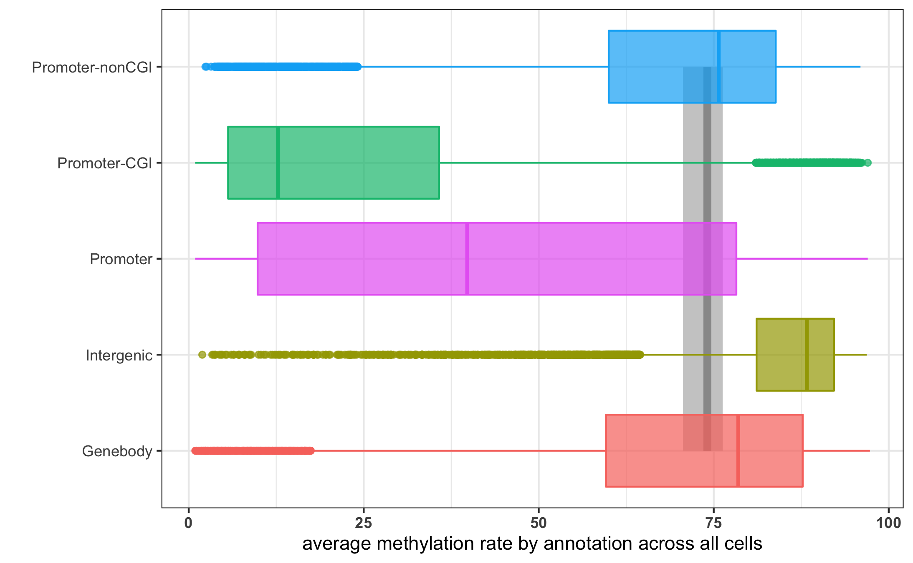
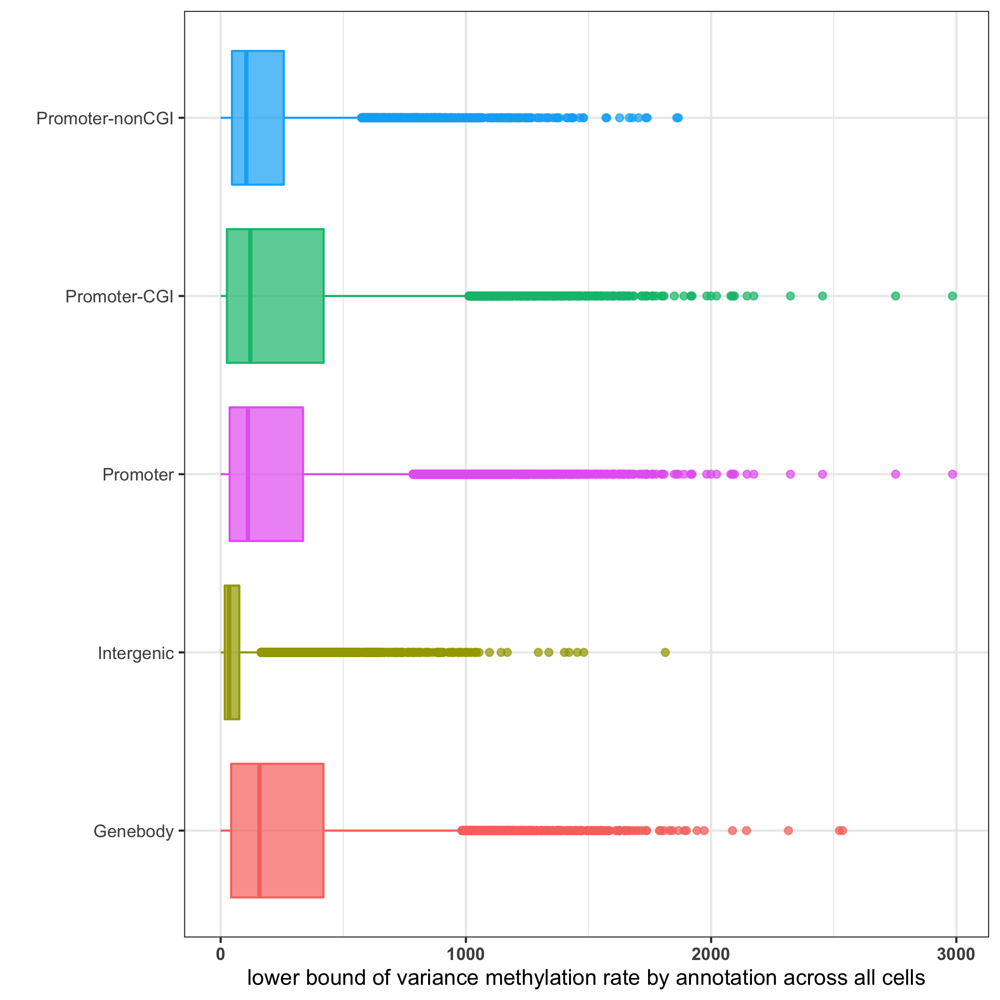

```{r}
## source libraries and functions
source(params$IN$utils)
source(params$IN$libs)
library(knitr)
```

```{r}
## check files and directories exist
check_files_exist(params$IN)
dir.exists(params$OUT$dir)
if(!dir.exists(params$OUT$img)){
  dir.create(params$OUT$img)
}
```


```{r, echo=FALSE}
knitr::opts_chunk$set(cache=params$cache, echo=params$echo,  cache.comment=FALSE,
                      fig.align = 'center',message=FALSE, warning=FALSE, results='hide')
```

## Sample Statistics

```{r}
## read sample stats and add total CpG, as well as rnaseq lib size and reduced dimensions to it
sample_stats <- readRDS(params$IN$sample_stats)
## total genome CPGs to also consider the reverse strand CpGs:
sample_stats[,c('cpg_coverage','cpg_mean_depth') ] <- sample_stats[,c('cpg_coverage','cpg_mean_depth') ]/2
rownames(sample_stats) %<>% substring(.,0,2)
sample_stats$global_mean <-  sample_stats$global_var <-  NULL
## rna-seq data
sce_rna <- readRDS(params$IN$sce_rnaseq)

genome_trincus <- readRDS(params$IN$genome_cpgs)
genome_tot_cpg <- 2*sum(genome_trincus$cpg_content[params$chrs_global_stats])

if(!identical(rownames(sample_stats), colnames(sce_rna))) stop("different sample names in sample_stats and sce_rna")

sample_stats %<>%  mutate(rnaseq_libsize = sce_rna$total_counts, cpg_total = cpg_coverage*genome_tot_cpg)
sample_stats <- cbind(sample_stats, do.call(cbind, reducedDims(sce_rna)))
```

CpG coverage vs Transcriptome library size

```{r}
## plot CpG coverage against transcriptome lib size and mark the points 3.5 MAD away
Xlim = sample_stats$rnaseq_libsize %>% (function(x) c(median(x)-4*mad(x), median(x)+4*mad(x)))
thresholds = sample_stats$rnaseq_libsize %>% (function(x) c(median(x)-3.5*mad(x), median(x)+3.5*mad(x)))
GeomLabel$draw_key <- function (data, params, size) { draw_key_rect(data) }
GeomLabelRepel$draw_key <- GeomLabel$draw_key
# filtered_samples <-c("") # c("H5","H8")
possible_multiplets <- c("F6")
sample_stats$qc <- "Passed"
sample_stats[possible_multiplets,]$qc <- "Possible Multiplet"
# sample_stats[filtered_samples,]$qc <- "Filtered"
```

```{r}
my_pdf <- function(title, out_dir=params$OUT$img, ...){
  return(pdf(paste0(out_dir,'/', title),...))
}
```


```{r}
cols <- gg_color_hue(3)
# my_pdf(title='libsize-cpg-coverage-double-genome-cpg.pdf',height=5, width=9)
ggplot(sample_stats, aes(x=rnaseq_libsize/1e6, y=cpg_total/1e6, col=qc))+
  geom_text(aes(label=rownames(sample_stats)), col = 'grey60', size=3 , hjust=-0.4, vjust=-0.5, show.legend = FALSE) + 
  geom_point(size=2)  + theme_bw() + 
  
  geom_vline(xintercept = thresholds/1e6, linetype='dashed', col="red")+ 
  geom_text(aes(x=thresholds[1]/1e6, y=2, label = "Mean - 3.5 * MAD"),col= cols[3],size=4, angle=90, vjust=2, hjust=0) +
  geom_text(aes(x=thresholds[2]/1e6, y=2, label = "Mean + 3.5 * MAD"),col= cols[3], size=4, angle=90, vjust=2, hjust=0) +
  scale_y_continuous(sec.axis = sec_axis(~(.*1e6/genome_tot_cpg)*100, name = "CpG Coverage (%)")) +
  labs(x="Transcriptome library size (Million)", y="CpG coverage (Million)", title = "BSseq CpG coverage vs RNAseq library size for all cells")+ 
  coord_cartesian(ylim=c(1,5), xlim=Xlim/1e6) +
  scale_color_manual(values=c("Passed"=cols[2],  "Possible Multiplet"=cols[1]),
                    guide_legend(title="Cell QC"))
# dev.off()
```


### Global CpG Methylation

```{r}
# my_pdf(title='pc12-color-global-methylation.pdf',height=5, width=9)
ggplot(sample_stats, aes(x=PC1, PC2, col=cpg_mean, size=rnaseq_libsize/1e6)) + 
      geom_point() + scale_color_gradient(low="red", high="green",
                                          guide = guide_legend(title="Mean CpG Methylation (%)")) +
  theme_bw()+
      guides(size=guide_legend(title = "RNAseq Library Size (x 1e6)")) +
      labs(x="scRNAseq PC 1", y="scRNAseq PC 2", title="")  +
      geom_text(aes(label=rownames(sample_stats)), vjust=-1, col="grey50", hjust=1, size=3, show.legend = FALSE)
# dev.off()
```

```{r}
# shinyAppFile('/Users/alabadi/Documents/_Projects/sc_sPLS/sc_sPLS_Rproj/02_Methylation/02_QC_Methylation/shiny_sample_stats.R')
```

## Genomic Contexts

```{r, eval=!params$load}
## load the methylation data
met_all <- fread(params$IN$met_merged)
## correct cpg coverage and content considering the reverse strand cpgs as well
met_all[, `:=`(cpg_cov=cpg_cov/2, cpg_content=2*cpg_content)]
## drop enhancers as there are weired enhancer coverages
met_all %<>% .[anno!="enhancer"]
## add cell coverage for features
met_all[,cell_cov:= sum(calls>0), by=c('id', 'anno')]
## log the filterings
met_file_log <- list()
## keep only canonical chromosomes
if(!is.null(unique(met_all$chr))){
  met_all %<>% .[chr%in%opts$chr_list] # & CpG_cov>=opts$min_cpg_cov
  met_all[,chr:=NULL]
}
## trim sample names to well names
met_all[,sample:=substring(sample,0,2)]
met_file_log$met_all$`1-base-dim` <- dim(met_all) ## 1195418 9


## add vhat and lci
met_all[,wij:=weight_se(rhat/100, calls)]
alpha=0.1
## estimate of mean for each site across cells
met_all[,
            rbar:=sum(wij*rhat)/sum(wij), by=c('anno', 'id')][, ## mean methylation across cells
            n_i:= (sum(wij)^2 - sum(wij^2))/sum(wij), by=c('anno', 'id')][, ## sum of sample weights at region i for call cells
            vhat:= sum(wij*(rhat-rbar)^2)/n_i,  by=c('anno', 'id')][, ## site variance across cells
            lci:= n_i*vhat/(qchisq(p=1-alpha/2, df = n_i)),  by=c('id', 'anno')][, ## lower bound of CI
            cv:=sqrt(lci)/rbar][,sd:=sqrt(lci/(.N-1)),  by=c('id', 'anno')][, ## coefficient of variation
            cpgcov_prop_bar:= mean(cpg_cov),  by=c('id', 'anno')][, ## add mean CpG coverage for each feature for filtering - proportion
            cpgcov_bar:= mean(calls),  by=c('id', 'anno')][, ## add mean CpG coverage for each feature for filtering - number
            sd_calls:= sd(calls),  by=c('id', 'anno')] ## add SD of calls to see if it correlates with lci
## get site_stats
met_site_stats <- met_all %>% .[!duplicated(.[,c('id', 'anno')])]
```


Percent of cells by minimum number of calls:

```{r}
min_calls <- c(1:40)
pct_cells <- sapply(min_calls, function(x) 100*sum(met_all$calls<x)/dim(met_all)[1])
# my_pdf(title = 'pct-of-cells-by-minmum-total-calls')
ggplot()+ geom_point(aes(x=min_calls, y=pct_cells), col='darkorange') + theme_bw() + labs(x='minimum calls', y='% of cells by minimum calls')
# dev.off()
```


```{r}
# pdf('../img/site-cpg-coverage-by-annotation.pdf')
gg_box(met_all, aesX = 'anno', aesY = 'cpg_cov',x='', y='Site CpG Coverage (/Total)', title='' )
gg_box(met_all, aesX = 'anno', aesY = 'calls',x='', y='Site CpG Coverage (log scale)', title='' ) + scale_y_log10()
# dev.off()
```

Add global methylation

```{r}
## global methylation summary and quantiles
global <- round(as.numeric(summary(sample_stats$cpg_mean)),2)
```
```{r}
CGI_site_stats <- CGI[,.(rbar=mean(rhat)), by=id][,anno:='CGI']

met_withCGI <- rbind(met_site_stats, CGI_site_stats, fill=TRUE)
```

```{r,eval=!params$load }
pdf('../img/Global-meth-by-anno-violin-CGI.pdf', width = 6, height = 4)
gg_box(met_withCGI[anno!='prom'], aesX="anno", aesY="rbar", x="", y="Average site methylation rate by annotation across all cells (%)", global=global)
# ggsave('../img/site-stats-rbar-by-annotation-plus-global.pdf')
# ggsave('../img/_png/site-stats-rbar-by-annotation-plus-global.png')
# 
dev.off()
gg_box(met_site_stats, aesX="anno", aesY="lci", x="", y="lower bound of variance methylation rate by annotation across all cells")
# ggsave('../img/site-stats-lci-by-annotation.pdf')
# ggsave('../img/_png/site-stats-lci-by-annotation.png')
# 
```


<!-- Does variance correlate with total calls or call uncertainty? -->

<!-- ```{r} -->
<!-- ggplot(as.data.frame(met_site_stats[anno=='prom_cgi'])) + geom_point(aes(x=vhat, y=sd_calls, col=rbar)) + -->
<!--   theme_bw() + labs(x='cell to cell variance in methylation', y='mean proportion of cpg sites covered', title='Promoter CGI') -->
<!-- ``` -->


```{r}
# shinyAppFile('/Users/alabadi/Documents/_Projects/sc_sPLS/sc_sPLS_Rproj/02_Methylation/02_QC_Methylation/shiny_sample_stats.R')
```


```{r, eval=FALSE}
# met_w3k_melt <- melt(met_w3k[1:1000], id.vars=c("seqnames", "start", "rbar", "vhat", "lci"), measure.vars =grep(pattern = "rate$", x=colnames(met_w3k), value = TRUE))
# 
# 
# rate_cols <- c("start",rate_samples,"rbar", "vhat","lci")
# cols <- c("start",samples,"rbar", "vhat","lci")
# 
# var_cols <- c("start",substring(grep(pattern = "rate.var", x=colnames(met_w3k[1:2]), value = TRUE),0,2),"rbar", "vhat","lci")
# rates <- met_w3k[,rate_cols, with=FALSE]
# vars <- met_w3k[,var_cols, with=FALSE]
# 
# 
# var <- met_w3k[,grep(pattern = "rate.var", x=colnames(met_w3k)), with=FALSE]
# 
# colnames(rates[,grep(pattern = "rate$", x=colnames(met_w3k), value = TRUE), with=F]) %<>% substr(.,0,2)
# colnames(vars[,grep(pattern = "rate$", x=colnames(met_w3k), value = TRUE), with=F]) %<>% substr(.,0,2)
# 
# rates_melt <- melt(rates, id.vars=)
# met_w3k_melt <- melt(met_w3k, id.vars = )
```


<!-- CHG Methylation -->

<!-- ```{r} -->
<!-- ggplot2::theme_set(theme_bw()) -->
<!-- ggplot(sample_stats, aes(mean_chg_met)) + geom_histogram(bins = 5, fill="darkblue") + labs(x="mean CHG methylation rate") -->
<!-- sample_stats$mean_chg_met %>% mean() -->
<!-- sample_stats$mean_chg_met %>% sd() -->
<!-- ``` -->

<!-- CHH Methylation -->

<!-- ```{r} -->
<!-- ggplot2::theme_set(theme_bw()) -->
<!-- ggplot(sample_stats, aes(mean_chh_met)) + geom_histogram(bins = 5, fill="darkblue") + labs(x="mean CHH methylation rate") -->
<!-- sample_stats$mean_chh_met %>% mean() -->
<!-- sample_stats$mean_chh_met %>% sd() -->
<!-- ``` -->


<!-- CpG coverage of sites: -->

<!-- ```{r} -->
<!-- ggplot(as.data.frame(met_site_stats), aes(x=cpgcov_prop_bar, fill=anno)) +   scale_fill_manual(values = df_anno$color, label=df_anno$context, guide_legend(title="Context")) + -->
<!--   geom_histogram(bins=30, show.legend = !FALSE) + facet_wrap(~anno) + labs(x="CpG coverage in region", y="Frequency") + theme_bw() -->
<!-- # ggsave('../img/cpg-cov-contexts-frequency.pdf') -->
<!-- ``` -->


Add scRNAseq data

```{r, eval=F}
## get a data.table of expression:
log_counts <- as.data.table(logcounts(sce_rna), keep.rownames = 'id') %>% 
  melt(variable.name = 'sample', value.name = 'expression')
## get a data.table of rowdata
row_data <- as.data.table(as.data.frame(rowData(sce_rna)), keep.rownames = 'id')
## merge across genes and repeat for each cell
gene_data <- merge(log_counts, row_data[,c('id','n_cells_by_counts','total','bio','FDR')], by = 'id', all.x=TRUE)
     ##                 id sample expression n_cells_by_counts    total       bio       FDR
     ## 1: ENSG00000000419     A5   5.573187                37 4.329723  1.494005 0.4000105
     ## 2: ENSG00000000419     A6   6.469338                37 4.329723  1.494005 0.4000105
     ## 3: ENSG00000000419     A7   7.179266                37 4.329723  1.494005 0.4000105
     ## 4: ENSG00000000419     A8   6.173938                37 4.329723  1.494005 0.4000105
     ## 5: ENSG00000000419     A9   0.000000                37 4.329723  1.494005 0.4000105


met_exp <- merge(met_all, gene_data, by=c('id', 'sample'), all.x=TRUE)

saveRDS(met_exp, file='met_exp.Rds')
# file_backup('met_exp.Rds',toplevel = '/Users/alabadi' , run_spec = 'added mean cpg coverage of sites and modified lci based on correct n_i')
```


